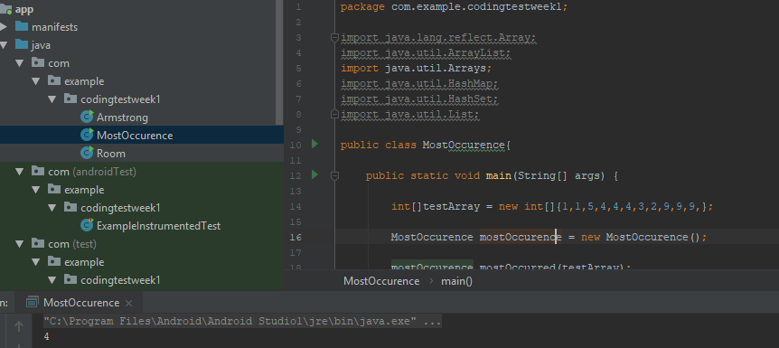
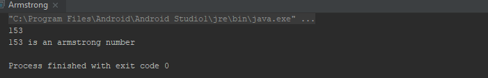

# Week1CodingTest

1. Create a function to find the most occurrence of an integer value given an integer array.
2. Simple Java Program to check or find if a number is Armstrong number or not. An Armstrong number of three digit is a number whose sum of cubes of its digit is equal to its number. For example 153 is an Armstrong number of 3 digit because 1^3+5^3+3^3 or 1+125+27=153
3. Complete the infected Room code challenge

